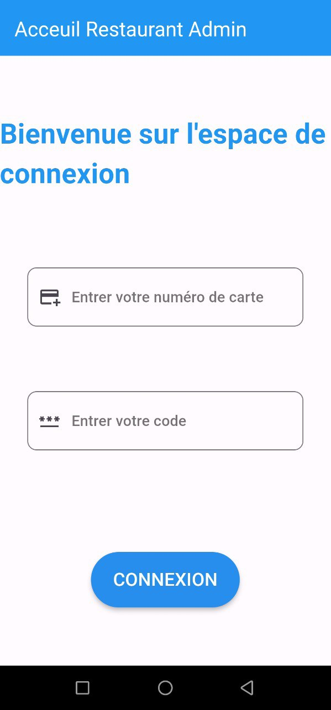
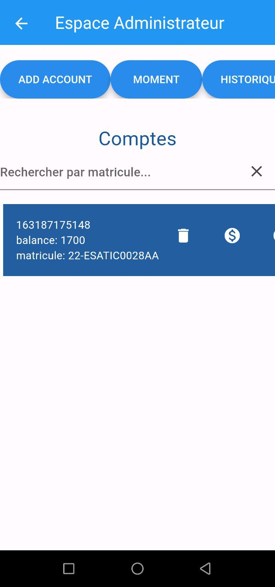
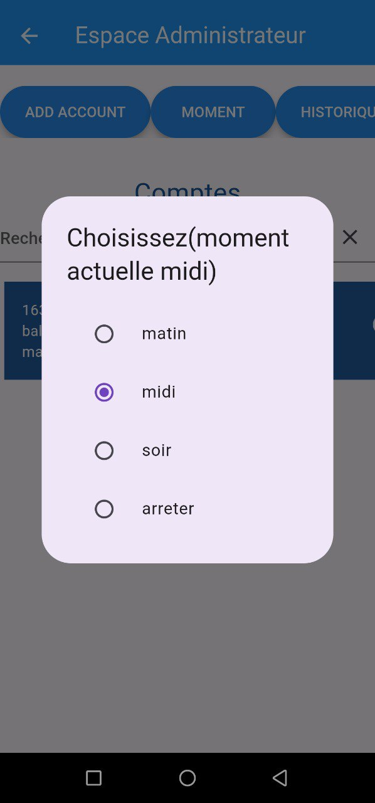
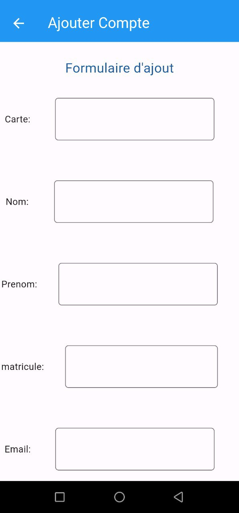
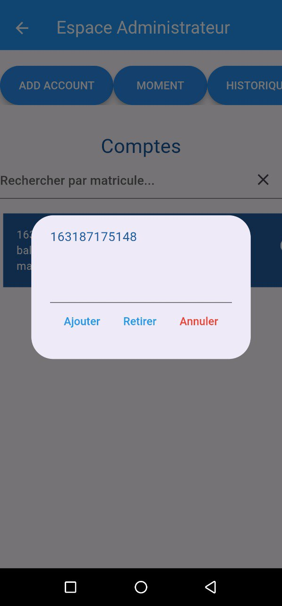
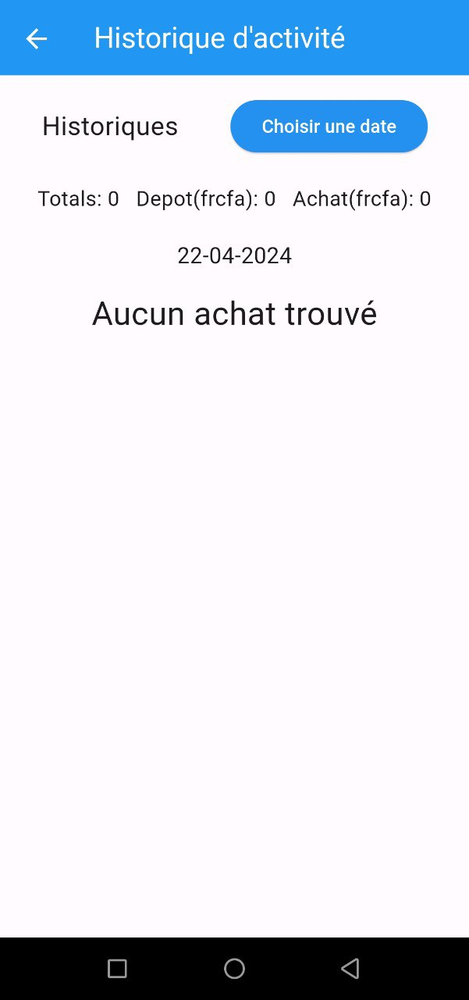

<h1>Restaurant Esatic Admin</h1>

<h3>Description</h3>
Restaurant Esatic Admin est une application de gestion de carte de restauration conçue pour les administrateurs. Que vous soyez un client régulier ou occasionnel, cette application vous permet de parcourir facilement les utilisateurs ajoutés et d'en ajouter d'autre modifier les temps de repas et voir l'historique des transactions par jour, et bien plus encore. Avec une interface conviviale et des fonctionnalités intuitives, Restaurant Esatic Administrateur vous offre une expérience agréable et pratique lors de votre visite au restaurant.

## Captures d'écran

<h3>Page de connexion</h3>

<h3>Page d'acceuil administrateur</h3>

<h3>Page des moments</h3>

<h3>Page d'ajout d'un utilisateur</h3>

<h3>Page de recharge solde</h3>

<h3>Page d'historique</h3>

<h3>Licence</h3>

Ce projet est sous licence MIT - voir le fichier <a href="LICENSE">LICENSE</a> pour plus de détails.
